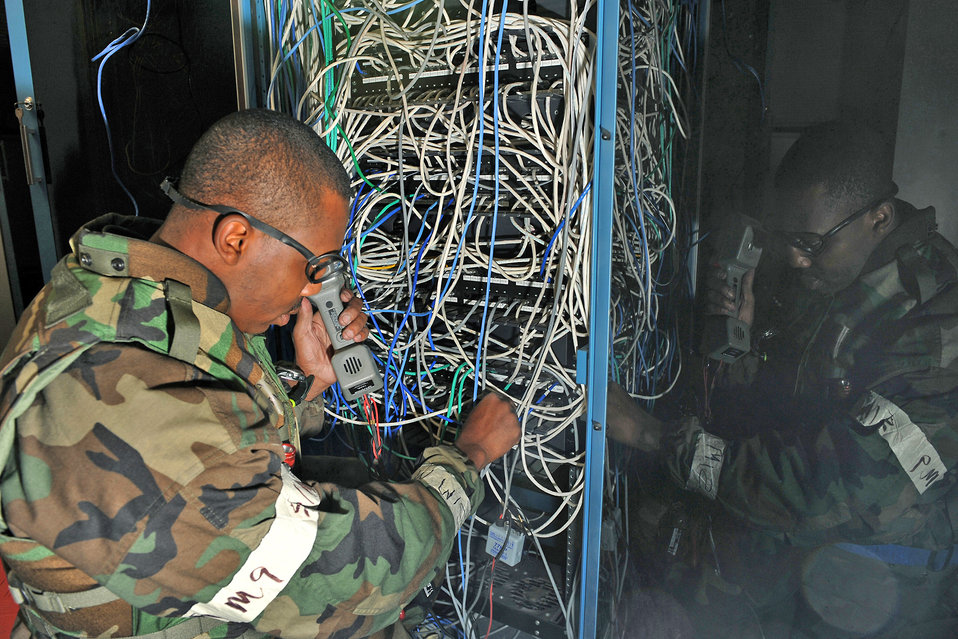

# Advent of Code 2019: Post 2
_Note: this post is part of a serie. You may want to read the first one to get the context._

Welcome back! I am glad to see you are still interested. Well, I have got good news for you. If the first two puzzles were mundane, the next serie batch interesting.

# DAY 3: [Crossed Wires](https://adventofcode.com/2019/day/3)
*A.k.a: Building the computer, step #1*

And on the third day, we get into more interesting territory. This exercice belongs to a category often encountered in Advent Of Code:
your input is a set of geometrical instructions you will have to interpret in order to discover some property.
In this one, you are provided with two paths that are represented as a list of relative segment.

## Part one
The objective is to determine the distance between the point of origin and the closest crossing between the two paths.

Your program must be able to:
- Parse the description: two lines of text each made by a comma separated list of patterns in the form of a letter and an integer (the letter being the direction of the segment and the integer being the lenth)
- Build some internal representation of those path to identify the crossings
- identify which cross is the closest

### Hint
Multiple strategies can lead you to the correct answer. You can store the paths as a set of segments and
work from here. It will result in a low memory consumption at the expense of more complex code.
Having the paths described as a set of segments may not be the simplest approach. You can establish the list of points/pixels of each segments.
No information is provided regarding the possible coordinates for the segment, but in practice you can use an array like 10000x10000 (you may have to perform an initial analysis to determine the maximum and minimum coordinates of those points).
On the other hands, you may notice that data is sparse, i.e. only a few points/pixels are actually used by one path or the other. This should lead you to the idea of using an index based storage (i.e. an hashtable or a map).

## Part two
Depending on how you've chosen to model the paths in the first part, this one can be easy or tricky. You need to esablish how far you will go on each path before reaching a crossing (between the two paths).

### Hint
If you decided to keep on using segments to describe the paths, getting this information should be easy.
If you used points, you should realize that it is difficult to compute the number of steps required to reach
a given points. Unless you captured this when you identified the points of each path.

## The code
You should try on your own! It should take you 20-30 minutes to get through this exercise. Someone with
some experience and appropriate helpers/library at hand will do this in a few minutes.

You can see my solution, as well as the data I was given [on Github](https://github.com/Alt-Net-AdventOfCode/AdventOfCode/blob/master/2019/Day%203/DupdobDay3.cs).

# DAY 4: [Secure Container](https://adventofcode.com/2019/day/4)
This one may feel a bit relaxing after the previous two. You are gonna work simple string analysis by counting how many 6 digits numbers match a set of requirements.
The input is simply a pair of value giving you the lower and upper limit of the range of numbers you must analyze.

## Part one
The objective is to count how many 6 digit numbers respect certain rules regarding digit/pattern repetition.

Your program must be able to:
- verify two criterias four roughly half a million numbers.
 
### Hint
I suggest you convert the number to a string before verifying the criteria. For the rest, take the time to test with the provided sample values to verify if you made any mistake.

## Part two
Part two just adds a third criteria on top of the previous two, hinting that you will get a lower result than before.

### Hint
It is just a matter of adding a few checks on the existing program. Once again, the key step is to test against sample values

## The code
You should try on your own! It should take you 5-10 minutes to get through this exercise.

You can see my solution, as well as the data I was given [on Github](https://github.com/Alt-Net-AdventOfCode/AdventOfCode/blob/master/2019/Day%204/DupdobDay4.cs).

# DAY 5: [Sunny with a Chance of Asteroids](https://adventofcode.com/2019/day/5)
_A.k.a: Building the computer, step #2_
Remember my comment on day 3: you will be implementing a computer all along the calendar.
In this exercise, you will add several new features to your computer. Indeed, only one feature will be missing once this puzzle is solved! It will not appear to be difficult, but debugging a computer simulator is tricky. That's why the main purpose of this puzzle is to help you build the computer you are going to use for a dozen more puzzles!

## Part one
The objective is to implement two new features:

1. Support for input/output thanks to two new opcodes.
2. Support for a (simple) new addressage mode: **immediate**.

You need to add support for those (re) using what you have produced for Day #3.
 
### Hint
In this puzzle, the input fuction simply has to provide '1', but bear in mind future puzzles will provide different value(s) for the input function, so you should ensure you can customize this.
Same thing for the output part, but this one is easier.

Adding immediate addressage mode is not difficult per se, but there is a significant risk of making a mistake when implementing it. That's why this puzzle is useful: if you make any mistake, the program will output the **opcode** that you are not able to process properly! 

## Part two
Ah, ah! Just when you thought that adding immediate mode and I/O function were exhausting, you have to add a bunch of new opcodes (4!).
The good news is that when this puzzle is done, you will make no further modification to
your computer's logic.

### Hint
Once again, while not really tricky per se, there is a significant chance for you to make some mistake during implementation. 
Conditional branching requires you to be careful regarding the management of the
'instruction pointer' (the location of the current/next instruction).
Making sure the provided samples run properly will help.
If you have not implemented this yet, you have to support variable length operations.

## The code
You should try on your own! It could take you up to 60 minutes (and maybe more) to get through this exercise.

You can see my solution, as well as the data I was given [on Github](https://github.com/Alt-Net-AdventOfCode/AdventOfCode/blob/master/2019/Day%205/DupdobDay5.cs).

# Stay tuned
This is end for this post. The next post will cover Day 6 to 10.