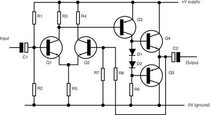
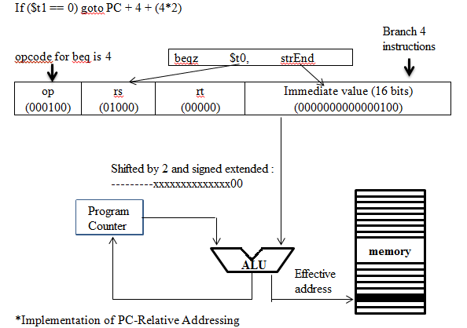

# Advent of Code 2019: Post 3
_Note: this post is part of a serie. You may want to read the first one to get the context._

Still reading this? Great. In this serie we will do some cool algorithms.

# DAY 6: [Universal Orbit Map](https://adventofcode.com/2019/day/6)
At last! Day 6 is about a classical algorithm: graph travelling!
You receive a large (acyclical) graph (mine was around 2100 edges) describing 
a group of stars orbiting one around the other.

## Part one
The objective is to compute the total number of orbits when counting secondary or indirect orbits, i.e. if A orbits around B and B orbits around C, one can consider than A orbits around C, giving a total of 3 orbits.

Your program must be able to:
- Parse the graph description (line separated pairs of identifiers)
- Store the graph with the appropriate data structure
 
### Hint
Step one is mostly about building the proper data structures. You have to bear in mind that no guarantee is provided regarding the order of declaration of planets. Since a planet can only orbit around one other planets but can have several planets orbiting around itself, it is easier to define a planet structure that stores a link to the planet it orbits around (called _center_ in my implementation).
Once you have the structure, having the total count of orbits simply requires to sum the number of orbits of each planet. And the number of orbits of any given planet can be determined by counting how many planets its is orbiting around, i.e. traversing the linked list of _center_s.

## Part two
The second part is slightly trickier: it is about travelling between two planets.
As you have a good in-memory representation of the graph (planets system), you have to determine a (shortest) path.
You should look for a well known path-finding algorithm and avoid designing your own!

### Hint
I use a simplified Djisktra algorithm, a.k.a flood-fill, i.e you explore the graph slowly until you find a path leading to the target/end planet. If you are not familiar with path finding algorithms, [Wikipedia article](https://en.wikipedia.org/wiki/Dijkstra%27s_algorithm) is pretty good.

## The code
You should try on your own! It should take you 20-30 minutes to get through this exercise. Someone with
some experience and appropriate helpers/library at hand will do this in a few minutes.

You can see my solution, as well as the data I was given [on Github](https://`github.com`/Alt-Net-AdventOfCode/AdventOfCode/blob/master/2019/Day%206/DupdobDay6.cs).

# DAY 7: [Amplification Circuit](https://adventofcode.com/2019/day/7)
And we are back on that computers of yours. Remember when I said it was as good as finished on day 5? I meant it. So now, it is time to put it to good use.
It will not be modified, we will simply use to run the provided programs with various inputs.

## Part one
The objective is to get the maxium possible value out of the program when varying the input values (0,1,2,3,4) order.

Your program must:
- implement a complete **IntComputer**, i.e. what you have implemented on day 5.
- run 5 copies of it ensuring the ouput of the first copy is used as an input for the second one and so one
- generate all possible orders for the group (0,1,2,3,4)
- try all possible value and keep the maximum results.

### Hint
You should probaly use several instances of the code that was implemented on Day 5.
Text hints it may not be needed (you may simply run them sequentially), but you will have to do this for the second part. 
The (somewhat) difficult part will be implementing the input/output logic.
You also have to generate all possible orders for (0,1,2,3,4). If you never implemented this, here is a hint: it can be build recursively.
Need another hint: it's kinda like picking the first digit, then appending all possible combinations of the remaining numbers...

## Part two
It is time to use a feedback loop, as in, the last computing engine output will be reused as an input for the first engine.
The tricky part is now that the engines are supposed to run **continuously**, feeding each other with their output values.

### Hint
There are probably several method to manage the continuous chain feeding of the engines. I chose the following logic:

- run the first engine till it produces an ouput value
- pause the engine
- run the next engine, feeding it the previous engine value, until it outputs a value
- pause the engine
- ...
- run the last engine, feeding it the previous engine value, until it outputs a value
- if all engines are halted, i.e. ran the _halt_ (99) opcode, we are done
- otherwise, start over

## The code
You should try on your own! It should take you 20-30 minutes to get through this exercise. Someone with
some experience and appropriate helpers/library at hand will do this in a few minutes.

You can see my solution, as well as the data I was given [on Github](https://github.com/Alt-Net-AdventOfCode/AdventOfCode/blob/master/2019/Day%207/DupdobDay7.cs).

# DAY 8: [Space Image Format](https://adventofcode.com/2019/day/8)
Day 8 offers a pretense to explore the magical world of bitmap image encoding. It is also the first puzzle that you will probably not fully automate and will requires your eyes and brain to solve, on top of some programming skills.

## Part one
Your objective is to analyse a bitmap file, **with an ad hoc, layer based, encoding**. You have to identify which layer has the maximum number of visible pixels, and then compute a magic number, defined as the product of the count of black pixels and white pixels.

Your program must be able to:
- Parse the description: a single string of digits (0, 1 or 2), reading layers one after the next. Note that the dimension of one layer is given but you have to figure out how many layers
- Identify which layer has the maximum number of pixels (i.e. different from 0
- count the number of '1' and the number of '2'

Compute the answer.
 
### Hint
Determining the number of layers is easy. To be honest, I think this part of the exercise should be pretty straightforward for anyone. The only, weak, challenge is to parse a long string of digits (a few KBs).

## Part two
Now you are ready to generate the full image. It requires merging the layers of the image in the proper order, skipping transparent pixels and keeping the first non transparent one.
And finally, you have to print it out so you can read the letters that are on the image.

### Hint
You need to process layers in order for each pixel. You can stop as soon as you have a non transparent pixel in one layer (and move to the next layer).
As the image is small, you can represent each pixel by a latter.
Letters may be difficult to read in the ouput, so do not hesitate to attempt various representations for the image. The best result was using **stars** for dark pixels.
Also, remember you need monospaced font to ensure alignment!

## The code
You should try on your own! It should take you 20-30 minutes to get through this exercise. Someone with
some experience and appropriate helpers/library at hand will do this in a few minutes.

You can see my solution, as well as the data I was given [on Github](https://github.com/Alt-Net-AdventOfCode/AdventOfCode/blob/master/2019/Day%208/DupdobDay8.cs).

# DAY 9: [Sensor Boost](https://adventofcode.com/2019/day/9)
Today is computer day. At this stage, you are either having fun playing with you very own computer, or you simply tired of this. If that is the case for you, you shoud consider skipping it. But bear in mind that every other exercise is using the computer!	

Overall, this is not a difficult exercise.

## Part one
The objective is simply to having a fully functioning computer. Nothing more, nothing less. You are going to add a new feature: relative addressing mode!
While not extremely difficult, this feature will require rigour in its implementation accross all statements.

Your program must be able to:

- implement a complete **IntComputer**, i.e. what you have implemented on day 5.
- add support for relative mode for **all** statements.
- that's it, just run it against the provided program

If your implementation is correct, the program will output the answer has a large number.
And if it is not correct ? I have great new for you: the program performs self
diagnostic and will output the first opcope that is not properly implemented.

### Hint
If the program fails to provide the answer, you need to grab the outputed opcode and review the implementation.

## Part two
The second part is even simplier: you just have to provide a different input than in part one (2 instead of one) and get the program results.
Depending on your implementation, this may take some time.

### Hint
To be honest, this exercise went pretty smoothly, as part one ensured there was no bug left in the *Intcode computer*. The text warns about a potential long running time, but I was lucky enough to have apparently an efficient implementation.

## The code
You should try on your own! It should take you 20-30 minutes to get through this exercise.

You can see my solution, as well as the data I was given [on Github](https://github.com/Alt-Net-AdventOfCode/AdventOfCode/blob/master/2019/Day%209/DupdobDay9.cs).

