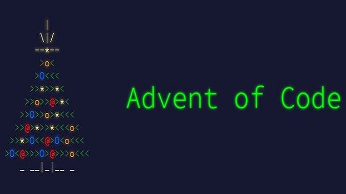
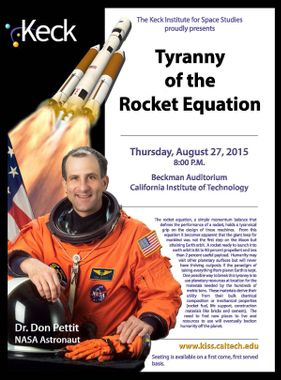
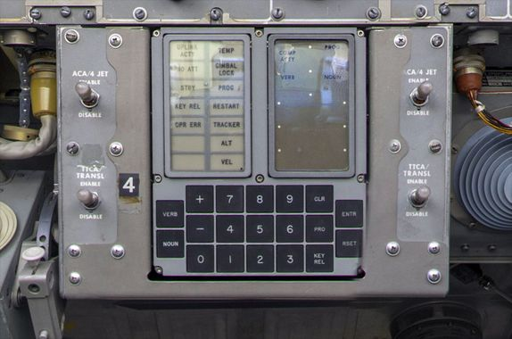

# Advent Of Code 2019
TLDR: This series of posts is a presentation of the 2019 Advent of code puzzles, why I found them interesting and a description of my solution, as well as a link to the code (C#).

## General presentation
*If you are familiar with* ***Advent Of Code*** *you can jump directly [here](#start).*

[AdventOfCode](https://adventofcode.com/) is based on the [Advent Calendar](https://en.wikipedia.org/wiki/Advent_calendar) idea, where one discovers one gift per day from December 1st until Christmas. It has been created and is maintained by Eric Wastl since 2015.
The principle is that a small programming puzzled is revealed each day for you to solve. Easy at first and slowly increasing in difficulty as Christmas approaches.
The general intent is to make this a learning experience. But for the more competition minded ones, the first 100 people able to solve each puzzle score points, and there is a general ranking accross the days.

Coding challenges and puzzles are nothing new; several platforms already exist (such as [CodinGame](codingame.com) or [CodeChef](codechef.com)); but AdventOfCode has a few specificities:

1. The advent calendar format: you have to wait for midnight, EST, to discover the challenge.
1. You do not submit your **code**, you need to give an answer which is a number or a short string.
1. Contestants have different sets of data, leading to different different answers, so one cannot cheat simply by copying/stealing someone else answers.

The fact that you do not have to provide your code, only the answers have several consequences:

1. You can use whatever language you feel like to (including **Excel**)
1. You can use whatever library/tools/execution platforms you want to (including your own cloud based calculator) as well as code for previous challenges
1. You can even solve some of the puzzles by hand, if you are careful and really, really patient.

One last thing: you can solve them anytime of the year you want. You can still access the 2019 challenge as well as previous years.

What I like most about it, is that I always learn a couple of things along the way, beside the fun of the challenge. What I find interesting is that you have to carefully read the given instructions, which ultimately amount to specifications.

## The structure of a challenge
Each challenge comes with:

* some introduction story
* a set of requirements
* a bunch of examples
* a link to your (specific) data
* an input field for you to provide the answer

When you solve the first part of the challenge, you win a star and the second part is unlocked, providing you again:

* some extension to the story
* a set of requirements (on top of or replacing some existing ones)
* a bunch of new examples
* a link to your (specific) data, which does not change between to the to parts
* an input field for you to provide the second answer

When you provide the second correct answers, you win the second star and the puzzle is solved. The 25th puzzle is different, because the 'second part' requires to fully solve the previous 24 challenges in order to win the 50th and last star.

When you provide a wrong answer, you may get some hints (such as higher or lower than the correct answers). There is a limit at which rate you can provide answers: one every minute! You have a five minutes wait when reaching the fifth attempts. If I remember correctly, you will face increasing dealy if you keep on providing wrong answers. This discourages any attempt to guess the correct answer by smart exploration techniques (I know, I tried once).

So, let's discuss each day challenge now.

# DAY 1: [The Tyranny of the Rocket Equation](https://adventofcode.com/2019/day/1) {#start}
The first puzzle is just an opportunity to get things running and making sure you get the gist of it.
This season, it was a simple reminder of **integer division**.

The title itself refers to an article from a NASA astronauts that highlights the fact that almost all the mass of space rocket comes from the fuel.

## Part one
You have to divide 100 integers by three and provide the resulting sum. This requires you to implement a program that can:

1. Parse a list of newline (\n) separated integer values
2. Divide each of these values by three (3).
3. Sum the result

### Hint
Remember the Eucledian arithmetic, where rounding is always on the lower bound. Using a language with built in support with integer types will suffice (note that I am not aware of any language not providing support for some integer type).

## Part two
A bit trickier, you have to do it recursively, for added fun.

### Hint
Recursion is your friend. As usual, the trick is when to end the recursion.

## The code
You should try on your own! It should take you 10-15 minutes to get through this exercise. Someone with
some experience and appropriate helpers/library at hand will do this in a couple of minutes.

You can see my solution, as well as the data I was given [on Github](https://github.com/Alt-Net-AdventOfCode/AdventOfCode/blob/master/2019/Day%201/DupdobDay1.cs).

# DAY 2: [1202 Program Alarm](https://adventofcode.com/2019/day/2)
The second puzzle is the first of a series that will ultimately lead you to the implementation of a simple **computer** on which you can run various programs. 

The puzzle title refers to the infamous computer error code that the astronauts faced when landing on the Moon.

## Part one
The objective is to determine the ouput value provided by the program you have been given.

For your very first version of the computer, it will only have to perform simple additions and multiplications. Your program must be able to:
1. Parse a list of comma separated integers (on a single line)
2. Implement a computer memory like state logic (simpler than it sounds)
3. Interprets 3 different opcodes

### Hint
Make sure you have properly read the requirements. Run the provided samples to make sure your program produce the correct results.

## Part two
The second part requires this time to identify which pair of input values are required to produce a given output.

### Hint
Brute force works effectively, as the number of possible solutions is low (10000). Therefore it is just a matter of being able to test them automatically until you find the right pair (of values).

## The code
You should try on your own! It should take you 10-15 minutes to get through this exercise. My implementation made sure of reinitializing the computer memory before each attempt, but I am not sure this is required for this exercise, but you will need this eventually.

You can see my solution, as well as the data I was given [on Github](https://github.com/Alt-Net-AdventOfCode/AdventOfCode/blob/master/2019/Day%202/DupdobDay2.cs).

# Stay tuned
This is end for this post. The next post will cover Day 3 to 5
