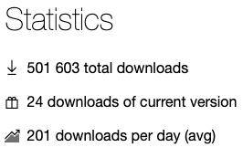

# NFluent and the 500K mark
This week marks several significant events for NFluent, and this deserve a specific post.

## NFluent V 2.7.0 has been released
This release brings new features, improvements and bug fixes

- You can now check if a **DateTime** (or **DateTimeOffset**) is close to an _expected_ **DateTime** (respectively **DateTimeOffset**) with a user defined _tolerance_. Use **IsCloseTo** for this check. See the [wiki](https://github.com/tpierrain/NFluent/wiki/DateTime-checks#isclosetoexpected-tolerance).
- It was impractical to check arbitrary properties on exceptions (beside the error message and the inner exception(s)) with previous versions of NFluent. With V 2.7 you can now extract any attribute and check it using **WhichMember**. Check the [wiki](https://github.com/tpierrain/NFluent/wiki/Check.ThatCode#whichmemberpropertyexpression-v27).
- You can provide your own **IEqualityComparer** when using **IsEqualTo**. See the [wiki](https://github.com/tpierrain/NFluent/wiki/All-types#isequaltoexpected-customcomparer).
- Equality comparison has been improved in the following ways:
  - **IDictionary** equality is content based, disregarding the order of entries.
  - the comparison logic is used recursively.
  - error messages have been revised for enumeration and dictionaries
  - NFluent suggests to use **IsEquivalent** instead when relevant.
  - NFluent mimic the Net implicit conversion logic for numerical types leading to more consistant results.
- The **Not** operator erased any custom message set through **WithCustomMessage** in previous versions. This has been fixed.
- **IsEquivalentTo** now uses the configured equality comparison logic, like 
**IsEqualTo**, leading to more consistant results.
- **IsEquivalentTo** is now recursive, which leads to better results when used on IEnumerable<IEnumerable<T>> (and so on).
- Enum properties were ignored when using **Considering**. This has been fixed.
- Check.That(IEnumerable<T>.**IsInDescendingOrder**() no longer requires _T_ to implement _IComparable_. This constraint was a remnant of an older design.

Note that this version still supports:

 - Net Classic versions from Net 2.0 and upward
 - Net Standard versions from 
In summary, the following GitHub issues have been closed:

306, 312, 313, 314, 315, 317, 319, 320, 321

## 500 000 download marks
Nuget download counter just crossed the 500K mark this week, with around 500 downloads per day (the 200/day here is the average since the project first release).

This confirms **NFluent as a major OSS project**. This also implies that NFluent helps thousands of software teams to produce properly tested code, leading to probably billions of assertion checked each day.
This makes me proud and I take this post as an opportunity to thank all of you who trusted us and our work!

This project is the result of Thomas Pierrain's idea and hard work and I have been carrying it over for the past 3-4 years, but it is also the contribution of many that brought code, contribution, ideas and issues.
This remains a collective effort and this is the **hallmark of OSS**. 

## 100% coverage mark
This latest release is also the most tested version of NFluent ever to be released. I made sure that:

- Each lines of code was tested. See [there](https://codecov.io/gh/NFluent/NFluent).
- All possible branches were tested. See [there](https://codecov.io/gh/NFluent/NFluent).
- 100% of mutants killed as tested by Stryker-Mutator .Net. See the [dashboard here](https://dashboard.stryker-mutator.io/reports/github.com/NFluent/NFluent/master).

Of course there is always the possibility of an issue, whatever the coverage you achieve. Nonetheless, reaching this rate of coverage is a **testimony of how important NFluent's software quality is to me**. I want you to be able to have complete confidence that assertions are safe and trustworthy.

And ultimately, ensuring this level of coverage helps me identify issues before you run into them. Adding [Stryker-Mutator](https://stryker-mutator.io/stryker-net/) to my toolbox helped me uncover some niche bugs and eventually triggered a redesign of significant portions of the code to reach a higher level of consistency.

## 7 years anniversary
The first ever release of NFluent (on Nuget) was made by Thomas in February 2013. I think it was **V 0.3**, if my memory serves me well. The oldest available version is **V 0.5** which was released in April 2013.

The project is now mature and stable.

Two years ago, I made a cute [video](https://www.youtube.com/watch?v=viq6zrW5rks) with Gourse to celebrate the 5 years anniversay.

I am working on a series of post that will retrace the major design evolutions the project went throught.

### Being the largest contributor
And the final mark, which is anecdotical at best, is that I am now NFluent's [largest contributor](https://github.com/tpierrain/NFluent/graphs/contributors), both in terms of commits as well as lines changed.
