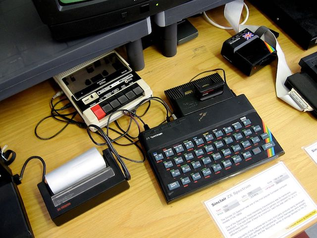
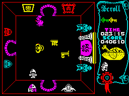
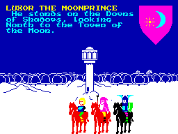
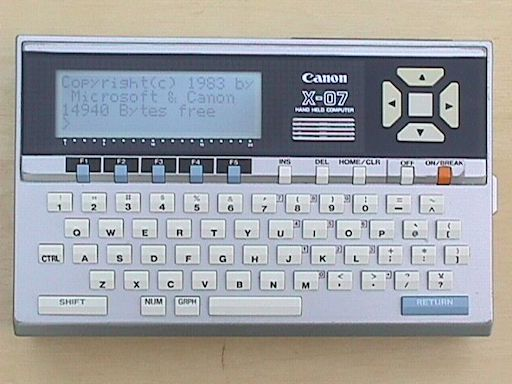

# Personal project log
This document is my history with IT described through personal milestones. May be this is a bragging list, there is no disclaimer of fitness of purpose or any value whatsoever for anyone but me.
By building this list, I simply wanted to:

- keep track of what I have done
- maybe trends and/or patterns

This is listed in chronological order, with no specific structure as of V1.

# Beginnings
## my first computer (1983)
A ZX Spectrum 48; a 4Mhz 16/8 bits CPU, 48Ko RAM, integrated Basic, tape storage. It has been my single computer for 4 years, dabbled with Basic and switched to assembler after two years or so.

To this day, I still remember clearly the command `POKE 23659,0` and [what it does.](http://www.users.globalnet.co.uk/~jg27paw4/yr02/yr02_27.htm).

### My first 'program' 
I don't remember my very first lines of code, but they were probably copied from the manual and written with my dad, since I did not understand English at the time.
At first, I spent most of my time playing with games.

 

What I consider to be my first personnal project was coding a puzzle game derived from a small tabletop game I found in a magazine (Jeux & Stratégie, April 1984)..jpg)

I implemented the game rules in BASIC, designed the (crude) graphics and debugged it in a couple of days. I did it mostly for education purpose, and was happy of achieving this as well as pretty much aware that it was not much more than a prototype.

This computer was later replaced by a ZX Spectrum+2 128Ko (due to some unfortunate accident involving myself tripping on the video cable).

My later (significant) projects were: 

- A copy program that was able to exploit the memory extension. As reading the tape required precise timing, the trick was to compensate for the time needed for memory bank switching.

## My first paid gig
My first professional gig gave me the opportunity to use a new platform: the Canon X07. This was a very small computer, kinda  like a pocket book in format, with 14940 bytes of available memory and a display of 4x16 characters. Along with it came a dozen of scribbled pages describing what the program was supposed to do.
It was an insurance fee estimator; dedicated to factory risks, it required getting between 20 and 30 input variables before outputing the estimaged fee(s) and covered amounts according to selected options.

I had a lot fun of working on this machine, despite it having such tiny keys and minuscule screen. It also was battery powered, and turned on and off instantly. 

You could save your program to battery powered memory cards. Memory limited you to maybe 4-500 lines of code, so it forced you to be creative in your design. Likewise, you could conect it to an external screen and I did not have access to a printer then; I had to remember the program structure to code.

I guess the program was at least a half success because I got feature requests afterward. The first one was to **provide a print out of the results**.