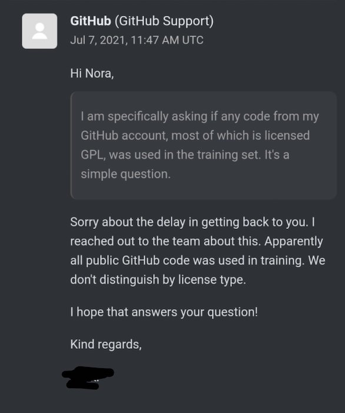

# TLDR;
Github Copilot is a disruptive proposition that could change forever how developers work; while it is difficult to ascertain any position, I think it will bring **significant, yet incremental** progress. But it raises many questions around collaboration; and I think we should be concerned for the future of **OSS** (and I don't think about licensing issues).
I propose to address the following questions:

1. What is Copilot?
2. Is it useful?
2. What are the impacts of such a tool?
3. What does it tell us about our trade?
2. How actually useful is it?

# Disclaimer
I have yet to experience Copilot first hand, but I have seen enough videos and read enough feedbacks to get the gist of it. In any case, I will talk here about the concept, not the product.

# What is Copilot?
[GitHub Copilot](https://copilot.github.com/) is touted as _'Your AI pair programmer'_. 
From an experience point of view, it works like an auto-completion engine, except that it does not merely suggest the end of the word you are typing (such as `ToS` ==> `ToString()`),  but full functions/methods or chunk of code. 

Most impressive results are achieved when CoPilot is able to suggest a full function simply based on the code comments you typed.

Note that Copilot is often able to offer several suggestions you can navigate through with the keyboard before validating one with `Enter`; then you can change, complete and alter the code.

Copilot is a service built on top of Codex, which is a Opean AI's [GPT-3](https://openai.com/blog/gpt-3-apps/) implementation dedicated to code generation (https://www.louisbouchard.ai/github-copilot/). In short, GPT-3 couples NLP with a (huge) neural net to produce very convising document based on correlation with provided keywords.

Here, GPT-3 has been trained with every public GitHub Repos, **disregarding their respective licences**: if it's public, it is faire game!

> Side note, I wonder how GPT-3 deals with various languages grammar. I have only seen text examples in english, I wonder how good it is with languages with more strict and complex grammar, such as german or french. This is a relevant question for Codex since correct grammar is an important topic for computer language.

### Wait! What?! Disregard for the licences ?!
Yes, this issue has already been heavily discussed elsewhere. In short, there is no actual issue. A more detailed answer is:

1. No, GPL does not result in Copilot generated code being GPL as well (same for any viral license)
2. This is akin to reading other people's code to learn from them, definitely fair use
3. Trying to fight this means applying copyright laws (and principles) to something that exists BECAUSE copyright laws were seen as hampering creation

Nope, not a good fight, sorry.

# It is a benefit, right?

## Simple case
Let's assume that Copilot works flawlessly for simple requirements and works partially for more complex ones.
The following demonstration is based on a simplistic view of the development effort, but I assume everyone understands it.

So it will help developers to code those properly with little effort, with a significant production increase for those.
Production here being expressed both as the number of requirements covered (KPI #1) and as the **number of lines of code** (KPI #2).

You see the problem: as a trade, we know that in general we want to maximize the number of implemented requirements while minimizing the written code; that is, keep **(KPI #1/KPI #2)**
as low as possible.

Why? because we know there is a maintenance cost associated with a line of code. Even if this is a simple function, that rarely needs change, what if the code needs to be migrated, or another team using different coding patterns takes the code over? A line of code is both an asset and a liability!

**Today, almost no one boasts about how large its code base is!**

So, in this simple term, I don't think it brings value if it is only able to support simple requirements.

## What about more complex requirements ?
Here are dragons! Everybody with some professional code experience knows how hard it is to extract and capture real world requirements in a written, structured form (spoiler alert, Copilot will
not help you there). For the sake of the argument, let's say that Copilot can process simple business requirements (_process_, not _understand_, it does not understand anything).
All examples I have seen so far imply there is still work to be done for the human developer once she/he has chosen the best copilot proposal. So we end up with some hybrid AI/human code with *no marking to tell them apart** . Again, code generation has told us repeatedly this is not a good idea :
those requirements are likely to change over time. Sadly, Copilot knows how to **generate code**, not change it in the face of a shift in requirements. In all likelihood, it means regenerating code as a whole, not altering it.
And god forbids if this imply some signature change: Copilot does not rely on an understanding of the language syntax is not able to perform any refactoring, such as dealing with the impacts of a signature change.

## So what about productivity then?
I am now pretty convinced Copilot brings little benefits in term of productivity. Furthermore, if anyone knows how to sell software, it is Microsoft (remember, Bill Gates kinda invented [the concept of paid software](https://en.wikipedia.org/wiki/Open_Letter_to_Hobbyists)). Hence I am pretty sure Microsoft guys themselves know this pretty well, otherwise they would already have a commercial/paid tier offer to sell.
As of now, we have a MVP released in the wild to see where it gets traction and how to extract value from this.
It may very well end up as a failed experiment (remember [Tay](https://en.wikipedia.org/wiki/Tay_(bot))?) or it may find its market. My best guess is that it will remain a niche market, like being used by some coding sweatshops producing low quality website/app for SOHOs.

# So why do I worry?
## a bit of context first
First, let me tell you a bit about my personal experience with coding, so that you understand where I come from and see my probable biases.
I started to code in the mid eighties; everybody was short-staffed on professional developers, and as working code was really expensive to produce (as compared with today), there was a strong focus on [DRY](https://en.wikipedia.org/wiki/Don%27t_repeat_yourself) and code reuse. [Libraries](https://en.wikipedia.org/wiki/Library_(computing)) were the solution; alas, available libraries were scarce. The languages provided some (standard libraries), there were a few specialized editors that provided commercial products but most of them  (libraries) were internal/private. Fast forward a couple of decades; early 21st century, Internet and OSS movement proved to be the enablers for a thriving library ecosystem.

## an ode to OSS libraries

Libraries are great. They provide us with ready made solutions for some of the requirements, but most of all, they allow for a separation of concerns!
The library's team is in charge of identifying the correct abstractions and build an efficient implementations. As such, using a library provides you help right now, when implementing
as well as in the future, when issues are found or changes are required.
If you copy paste the library code, instead of depending on its distribution package, you will have to deal with any needed changes in the future. But the worst part is that you will have to 
understand its design and internal abstractions first if you want to maintain and fix it, and you need deep understanding if you want to extend it.

Using an **external dependencies** bit the s**t out of copy pasting part of it, hands down, every day; that is assuming a decent dependency ecosystem (see the [LeftPad Debacle}(https://www.theregister.com/2016/03/23/npm_left_pad_chaos/) five years ago).

## The problem

Let's have a systematic view at this:

If Copilot is useful (for the short term), and this is a big if, as we will discuss later on:

- Coders are less likely to look for OSS libraries to help them.
- Less users means less feedback (issues and feature requests), less contributors and less motivations for OSS authors.
- Less energy in OSS result in a slightly less dynamic OSS ecosystem
- A less dynamic ecosystem mat increase the relative value of Copilot

Here we have a (slow) Copilot usage reinforcement loop that could theoretically lead to a complete dry out of OSS ecosystems.
Which would be a bummer, since the OSS ecosystems is the **source material** for Copilot.

I am not saying this will, or even could, happen. But **I see no interesting equilibrium point** beyond a marginal use of Copilot.

Not that there is a parallel to be drawn between Copilot and (arguably) the most famous
coding website: 

the parodic idiotic coder that copy paste StackOverflow found code without adjusting it
to his/her own project would be replaced by the idiotic Copilot user that fails to correct the
generated code.

Except that fixing Copilot will likely requires more work.

Also, the value of StackOverflow does not reside in the posted code extracts, but in the embedded social network that increase its value 100 fold by providing context and assistance
to people looking for help.
Features that are sorely lacking for Copilot.

# But Copilot is still useful, right?

## Watch out for the bugs
Well, it is still early to get a definitive answer, but I am getting more skeptical by the day.
I think we can make a parallel with self driving car: we are, slowly, getting Level 4 assistance (see [here](https://www.synopsys.com/automotive/autonomous-driving-levels.html) for level definitions) but level 5 seems further way every time we look for it.

The main problem with Level 4 is making sure the driver takes over when necessary. For a car, the problem is that the driver's focus will not be on the road when the problem arises, leading to dangerous delay. For Copilot, the problem is that the issue will be hidden in the complexity of the code.

Let me illustrate this with a Copilot example (see [original tweet](https://twitter.com/feross/status/1410037687541633029)). 

You see the problem? the color can **never be 16777215**, ie 0xFFFFFF, aka pure white.

1. The fix is simple: you need to use 16777216 instead. 

2. How do you fix every copy of this code ?
 
 You don't as you can't identify them, since it is likely that Copilot will have 'generated' sligthly different versions: varying variables or function names for example.

3. How do you make sure **future** version of this algorithm are correct?

 You can't as you cannot identify the source of this!

Furthermore, this example also illustrates that Copilot has absolutely no semantic understanding of what it does: if it relied of some internal understanding of what a _color_ is (from an IT perspective), the code would have been correct.

It is likely a source of subtle bugs...

## It will resolve the problem of boilerplate code
This one is very likely. Boilerplate code, the lines that must be written due to some technical requirements (generally due to some library) and bring little value to the general requirements can be masterfully managed by Copilot.

From my point of the view, boilerplate code is the sure sign of a design in need of improvements. If Copilot removes this pain, the design will never be improved and we will rely on Copilot as a crutch instead.

## It will help people write tests
I have seen several examples of using Copilot to generate unit tests out of comments. That could be an interesting approach, but I am not sure how this could prove to be better than using BDD tooling (Cucumber/Specflow....).

Being a TDD practitioner, I see writing a test as a design exercise, as such, I think of this step as the one that requires the most skills. Hence, it does not appear natural to me to delegate this to an AI.

## First users are delighted
There is definitely a wahou effect for the first time users, but I am waiting for longer term evaluation. Not holding my breath for those, as I expect them to reveal several limitations that reduce the interest for the tool.

# Is there any chance Github Copilot could be useful?
Not in its current form, as I said in the previous paragraphs. But I think different approaches could be useful (assuming those are possible, I am no GPT3 expert):

1. Use it as library/framework search tool. Picking a library is a really difficult exercise, and finding one is an even harder challenge. A tool for that could be a game changer; it would also be a power play quagmire, but it's another discussion
2. Use it to suggest code improvements/simplifications. Crafting good code is difficult, we need help for this.
3. Make it contextual: Copilot should learn from your project context and adjust its suggestions accordingly. So that it can based its proposals on your dependencies for example. Probably hard to do.
4. Create a feedback loop, à-la-StackOverflow. There should be a way for Copilot to learn directly from its users. Maybe it is the case as of now, but there is no evidence to corroborate this.

# Conclusion
In short, GitHub Copilot
1. **Is** a significant technical achievement
2. **May be** a danger to OSS in general
3. **Should not** be a success in its current form
4. **May not** end up in a commercial available form
5. **Is** the sure sign of similar AI powered tools to come.

# References
Here a few further references

. [Is GitHub Copilot a blessing, or a curse?](https://www.fast.ai/2021/07/19/copilot/)

. [GITHUB COPILOT AND THE UNFULFILLED PROMISES OF AN ARTIFICIAL INTELLIGENCE FUTURE](https://hackaday.com/2021/08/02/github-copilot-and-the-unfulfilled-promises-of-an-artificial-intelligence-future/)

.[Captain Stack](https://www.producthunt.com/posts/captain-stack)

