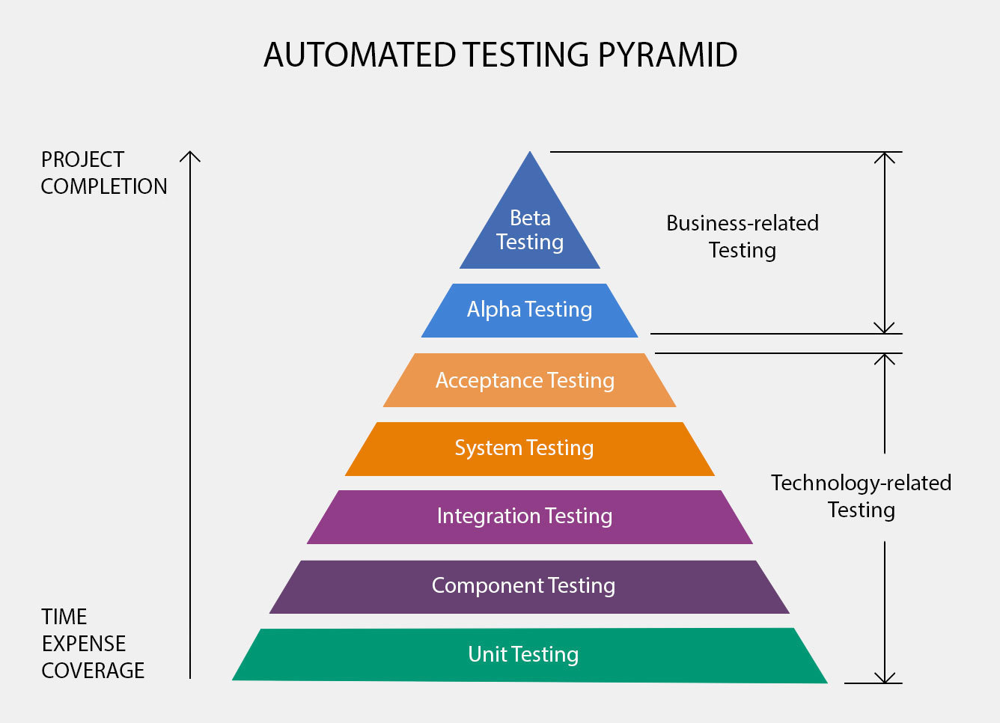

# Unit testing, you're doing it wrong

TLDR; Existence of untested code in the wild should worry you. Good news is
that you can do something about it. Also, there is a confusion about what
__unit__ testing means.

# Disclaimer
I understand that I am addressing a very sensitive topic; I will probably
offend many readers that will say that I am an insane troll and that my views are bullshit. Offending is not my objective, but I  stand by my opinions. Of
course comments are here to help you voice your opinion. And yes this piece is
biased by my past experiences, but that's the point of it, sharing my
experiences.

## How legitimate are you?
Fair question. I have a 35 years career in IT; I have worked at companies of
various sizes and culture. I have often been in some transversal position and
had the opportunity to meet and work with a lot of developers (think x000s)
While most of my positions involves code, I also touched on QA and BA
activities. I am now in CTO-like positions for 2500 ITs and had the great
privilege to work with well-known french experts, as well as lesser-known ones.

So my opinion is based on things and events  I have experienced first-hand as
a developer, things I have seen others struggle or succeed with, problems
encountered by teams I have helped as well and views and issues that other
experts taught me about.
And more books than I can recount. Of course, this dos not imply that I am
right, but at least, grant me that I have a comprehensive view of what I am
talking about.

# Fallacies about unit testing

### 1. TDD is all about unit tests
**Big NO**, TDD, a.k.a 'Test First Development' is about __defining what the code is
expected to produce, capturing this __as some __test(s) and__ then __implementing just
enough code to make it pass__. Unit testing is about __testing small parts of
the code in isolation__, e.g. testing some class's methods, maybe using some
stubs/mocks to strip dependencies.

[**Unit tests are promoted for their speed and
focus**](https://en.wikipedia.org/wiki/Unit_testing#Description): they are
small, with limited dependencies, hence run (usually fast). When a unit test
fails, it is easy to identify which part of the code is responsible.

Actually, [TDD is about **every form of
tests**](https://en.wikipedia.org/wiki/Test-driven_development#Test-driven_development_cycle)
. As an example, I often write performance
tests as part of my TDD routine; end-to-end tests as well.

### 2. Automated testing is all about unit tests
No, automated testing describes a process: having tests automatically run as
part of your build/delivery chain. It covers every kind of tests you __can
perform automatically__: behavior tests, stress tests, performance tests,
integration tests, system tests, UI tests....

There is an emphasis on unit tests because they are fast, localized and you
can execute them en masse. But **integration tests, end-to-end tests, system
tests, performance tests**, you name it, **must be part of your building
chain**.

### 3. 100% code coverage requires extensive unit testing
NO, NO, NO and f...g no. **Improving coverage by adding tests that exert not
yet tested methods or classes is wrong** and lead you to a frozen hell of
coupling and entanglement, where any code change breaks tests and you spend
your time fixing them. In theory, **untested code should not exist in the
first place**, according to TDD mantras.

Writing a test is akin to writing down a contract or a specification, it fixes
and enforces many decisions.
__Your tests must focus on use cases__, behavior, use case and end to end tests
are probably the most important ones. Code coverage must include every tests,
disregarding its type.

### 4. You have to make private methods public to reach 100%

Again, **no**: private methods must be tested through public entry points. If they cannot be tested in full, you need to __challenge the relevance__ of the
non covered part: __it is __probably __useless code.__

Wondering about how to test private methods is a clear sign you've got TDD
wrong. If this is not clear to you, I suggest you stop **ALL UNIT TESTING**
altogether and contemplate BDD. When **you get the grasp on BDD**, you will **be able to embrace TDD**.

### 5. Some code should not be tested
This one is somewhat true, but probably not to the extent you think it is:
__code that works by construction does not require testing if it never changes__.
That being said, please show me some code that will never change.

Same for trivial code: I am an average developer, and my long
experience have taught me that code that works on the first attempt is an happy
accident. Even if you are the god of code, chances are somebody else will break
your code in a couple of months, weeks or even hours.
And yes, that somebody else is probably the future you.

As I said earlier, a test is a contract. And contracts exist because people
change, context changes, etc....

### 6. You need to use a mocking framework
Nope, **chances are you don't**. Mocking frameworks are great pieces of
engineering, but almost every time I have seen a team using it, mocks were
everywhere with little to no added value. I have seen tests that ultimately
test no production code whatsoever, but it took me hours peering at the code to
realize it.

Unit testing does not mean you have to mock every class dependencies. Mocks are
here to help you get **rid of slow or unstable dependencies**, such as a remote
services, or some persistent storage.

You should not test for collaboration/dependencies between classes. Those tests
are useful if you do bottom-up/inside-out TDD, but **you probably have to get
rid of them once the feature is complete**.
Philippe Bourgau has a
[great set of posts on this topic](philippe.bourgau.net/careless-mocking-considered-harmful/)
 if you are willing to dig further.

### 7. Tests are expensive to write
Yes, **testing is expensive in most of industries**: think about testing
a home appliance, a drug or a new car...

But **code is incredibly cheap**, giving
the impression that tests are needlessly costly, in a relative way.

They require effort, but they are efficient compliment or even replacement
for  specifications, they improve quality, bring fast feedback, secure
knowledge for newcomers.
The main problem is that **green tests look useless** both to the team and to
management.

### 8. The 'testing pyramid' is the ultimate testing strategy
You have probably heard of the **testing pyramid**. It basically states that
you should have **a lot of unit tests**, less component tests, then less
integration tests, and so one, up to the top of the pyramid where you have **a
few use case based/acceptance tests**. It is used as the default testing
strategy for most projects.

Truth to be told, the ** testing pyramid outlived its usefulness**.
Its original purpose was to address the fact that high level tests can have a
long execution time and that cause for causes of failure may be hard to
identify. It therefore pushes to invest more in unit tests, which are both fast and local, by definition.

This is also a dangerous analogy, giving the impression that a ratio of 1000 to 1 between unit and use case based tests is a desirable thing.

> **You should focus on the top of the pyramid, not the bottom !**

I have often seen teams that have **a handful of high level tests**, that
covers some of the core use cases, in a very basic fashion that are nothing
more than **glorified smoke tests**. And then thousands of unit tests to
ensure a high coverage.

This is not good.

# What about some truths ?

### 1. Unit tests are not about testing a method in isolation
[Kent Beck says it so much better than I could ever do.](https://www.facebook.com/notes/kent-beck/unit-tests/1726369154062608/)
>From this perspective, the **integration/unit test frontier is a frontier of
design**, not of tools or frameworks or how long tests run or how many lines
of code we wrote get executed while running the test.
>
>**Kent Beck**

### 2. 100% coverage does not mean your code is bug free
This the first rebuttal I get, whenever I talk 100% coverage.
Of course, __it does not__. Coverage only shows which part of the code have
been executed. It does __not guarantee that it will work in all
circumstances__, and it may still fail for specific parameters' values, some
application state or due to concurrency issue. Also, it does not prove the
code produce the required output in itself; **you need** to have **adequate
assertions** to that effect.

**This is especially true if you only perform unit testing!**

Coverage metrics are not about what is covered, but **about what is not
covered.**

### 3. There is a tooling problem
The truth is **unit tests are in the spotlight** mostly **thanks to tooling!**
We should be all eternally grateful to Kent Beck for 'inventing' sUnit, the
library which triggered a testing revolution, but __we must not stop there__.
Have you tried **Cucumber** to have a more use case driven approach? You may
also consider using
[**Mutation Testing**](https://en.wikipedia.org/wiki/Mutation_testing)
, to assess the quality of your tests.
[**Property Based Testing**](http://blog.jessitron.com/2013/04/property-based-testing-what-is-it.html)
 is also a step in the right direction.

### 4. It is difficult
Yes, but this is **no more difficult than designing the software up front**.
You face complexity, but what is interesting in test first approaches,
is that you have an opportunity to focus on
**[essential complexity](https://www.quora.com/What-are-essential-and-accidental-complexity)**
as test code ought to be simpler than actual implementation.

I have now animated many craftsmanship discovering sessions based on [Lego exercises (French slides)](https://speakerdeck.com/dupdob/software-craftsmanship-par-la-pratique)
. After the TDD exercise, attendants often express that **the difficult part
was choosing the right test**, and building the solution was straightforward.
Interestingly, even non coder profiles (BA, managers, CxO) share this feeling,
often saying how comfortable it was just following requirements, versus the
hardship of identifying a test.

>  Choosing the next test is an act of design.
>
>  (attributed to) Kent Beck

I attribute this difficulty to a set of factors:
1. it forces you to think problem first, while solution first is everyone bias
2. it constraints your design, and nobody likes extra constraints
3. it gives you the impression of being unproductive

### 5. Tests require maintenance
Tests require maintenance effort as any other piece of code. It needs
refactoring along the source code of course, but it may also requires
refactoring on its own.
They will have to be updated if new use cases are identified, or if existing
ones must be altered.

To sum it up: **tests are part of your codebase and must be treated as such**.

### 6. Having too many tests is a problem
Since **tests need to evolve along the production code**, too much tests will
hamper your productivity: if changing some lines of code break hundred
tests or more, the cost (of change) becomes an issue.
This is a sure sign of failing to tender for your tests appropriately:
tests are replicated with only minor variations.

I have seen projects and teams that were grounded to a halt due to having a
large test base. Then there is a strong likelihood that the test base may be
simply thrown away, or cut through savagely.

Ultimately, **tests also increase build time**, and as you are doing continuous
build/delivery (you are, aren't you?), you need to keep build time as low as possible.

### 7. Throwing away tests is a hygienic move
**It should be obvious by now that you need to maintain a manageable number of tests.**
Therefore you must have some form of optimization strategy for you test base.
Articles are pretty much non existent for this kind of activity, so let me make
a proposal:
- getting rid of _scaffolding tests_ should be part of your TDD/BDD coding cycle.
By scaffolding tests, I mean tests that you used to write the code in the
first place, identify algorithm(s) and explore the problem space.
- make regular code coverage review, identify highly tested lines and remove
tests you find redundant.

You can see [this thread](https://twitter.com/Cyrdup/status/1016314667583574016) for an extensive
discussion on having too many tests.

### 8. Automated tests are usefulness
As said earlier, a **green test looks useless**, **like any security device: safety belt, lifevest, emergency brakes...**
Putting TDD value aside, tests prevent failures

[Simple testing can prevent most critical failures](https://blog.acolyer.org/2016/10/06/simple-testing-can-prevent-most-critical-failures/)

[Source PDF](https://www.usenix.org/system/files/conference/osdi14/osdi14-paper-yuan.pdf)
# Appendix

[TDD article](http://members.iinet.net.au/~ijoyner@ihug.com.au/Ian_Joyner/TDD_vs_DBC.html)
