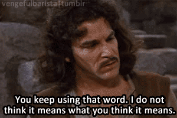
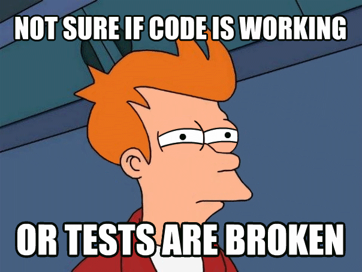

# Unit testing, you're doing it wrong

TLDR; Existence of untested code in the wild should worry you: most of our
lives is now somehow software controlled. Good news is
that you can do something about it. Also, there is confusion about what
__unit__ testing means.

# Disclaimer
I understand that I am addressing a very sensitive topic; I will probably
offend many readers that will say that I am an insane troll and that my views are bullshit. Offending is not my objective, but I  stand by my opinions. Of
course comments are here to help you voice your opinion. And yes this piece is
biased by my past experiences, but that's the point of it, sharing my
experiences.

## 'How legitimate are you?''
Fair question. I have a 35 years career in IT; I have worked at companies of
various sizes and culture. I have often been in some transversal position and
had the opportunity to meet and work with a lot of developers (think x000s)
While most of my positions involves code, I also touched on QA and BA
activities. I am now in CTO-like positions for 2500 ITs and had the great
privilege to work with well-known french experts, as well as lesser-known ones.

So my opinion is based on things and events **I have experienced first-hand** as a developer, things I have seen others struggle or succeed with, problems
encountered by teams I have helped as well and views and issues that other
experts taught me about.
Basically, I have been through all this sh*t and made most of the mistakes
listed here.
Of course, this dos not imply that I am
right, but at least, grant me that I have a comprehensive view of what I am
talking about.

# Fallacies about unit testing

### 1. TDD is all about unit tests

**Big NO**, TDD, a.k.a 'Test First Development' is about __defining what the code is
expected to produce, capturing this __as some __test(s) and__ then __implementing just
enough code to make it pass__. Unit testing is about __testing small parts of
the code in isolation__, e.g. testing some class's methods, maybe using some
stubs/mocks to strip dependencies.

[**Unit tests are promoted for their speed and
focus**](https://en.wikipedia.org/wiki/Unit_testing#Description): they are
small, with limited dependencies, hence run (usually fast). When a unit test
fails, it is easy to identify which part of the code is responsible.

Actually, [TDD is about **every form of
tests**](https://en.wikipedia.org/wiki/Test-driven_development#Test-driven_development_cycle).
For example, I often write performance
tests as part of my TDD routine; end-to-end tests as well.
Furthermore, this is about requirements, not implementation: **you  write a
new test **when you need** to fulfill a requirement. You do not write a test
**when you need** to code a new class or a new method**. Subtle, but important
nuance.

And when Kent Beck wrote about tests being isolated, he meant between one and
another. For example, having one test inserting record in a table while
another reads that same table is probably a bad idea, as the result of the
tests may vary depending in the order of which the tests are run.

___

### 2. Automated testing is all about unit tests
No, automated testing describes a process: having tests automatically run as
part of your build/delivery chain. It covers every kind of tests you __can
perform automatically__: behavior tests, stress tests, performance tests,
integration tests, system tests, UI tests....

There is an emphasis on unit tests because they are fast, localized and you
can execute them en masse. But **feature tests, use case tests, system
tests, performance tests**, you name it, **must be part of your building
chain**.
You must reduce as much manual tests as you can. Manual tests are expensive
and give slow feedback.

___

### 3. 100% code coverage requires extensive unit testing
NO, NO, NO and f...g no. In a perfect TDD world, **untested code does not
exist in the first place**.

Writing a test is akin to writing down a contract or a specification, it fixes
and enforces many decisions.
__Your tests must focus on behavior__; behavior driven and use cases tests are the most important ones. Code coverage must include every tests,
disregarding its type.

**Improving coverage by simply adding specific tests for untested methods and
classes is wrong**. Added tests must be justified by some
requirements (new or existing); otherwise, it means the **code has no actual
use**. It will lead your codebase to excessive coupling between tests and
implementation details and your tests will break whenever refactoring occurs.

For example, if you implemented a calendar module that support [Gregorian to
Julian
conversion](https://www.timeanddate.com/calendar/julian-gregorian-switch.html),
 either you have a pertinent test for this feature, or you just remove it.
___

### 4. You have to make private methods public to reach 100%

Again, **no**: private methods will be tested through public entry points.
Once again, **unit testing is not about testing methods one by one**.

Wondering about how to test private methods is a clear sign you've got TDD
wrong. If this is not clear to you, I suggest you stop ** UNIT TESTING**
altogether and contemplate BDD. When **you get the grasp on BDD**, you will **be able to embrace TDD**.
If they cannot be tested in full, you need to __challenge the relevance__
of the non covered part: __it is __probably __useless code.__
___

### 5. Some code do not need be tested
###### The design of the Death Star is Rebel proof, right ?!

This one is somewhat true, but probably not to the extent you think it is:
__code that works by construction does not require testing if it never changes__.
That being said, please show me some code that will never change.

Plus, I am an average developer, and my long
experience have taught me that my **code working on the first attempt is an
happy accident**.
Even if you are the god of code, chances are somebody else will break
your code in a couple of months, weeks or even hours.
And yes, that somebody else is probably the future you. Remember as I said
earlier, a test is a contract. And contracts exist because people
change, context changes, etc....

I often get this remark: **"Testing getters or setters is simply a waste of
time."**. Seems pretty obvious, isn't it?
What is wrong with this remark is the **implicit notion of testing (trivial)
getters or setters in isolation**. Which would probably be not only useless
but likely harmful.
Unit testing is not about testing method in isolation. **Your getters and
setters should be tested as part of a larger, behavior related, test.**
___

### 6. You need to use a mocking framework
###### Isn't it cute and mesmerizing ?

Nope, **chances are you don't**. Mocking frameworks are great pieces of
engineering, but almost every time I have seen a team using it, mocks were
pervasive within the test base with little to no added value. I have seen
tests that ultimately
test no production code whatsoever, but it took me hours peering at the code to
come to that conclusion.

Often teams are using mocks to test class in isolation, mocking every
dependencies. Remember, **'unit'** in unit testing is to be understood **as a
module or a component, not a class.**

Whenever you decide to introduce a mock, you enforce a contract that makes
refactoring more difficult.

Mocks are here to help you get **rid of slow or unstable
dependencies**, such as a remote services, or some persistent storage.

You should not test for collaboration/dependencies between classes. Those tests
are useful if you do bottom-up/inside-out TDD, but **you must get
rid of them once the feature is complete**.
Philippe Bourgau has a
[great set of posts on this topic](philippe.bourgau.net/careless-mocking-considered-harmful/)
 if you are wanting to dig further.

### 7. Tests are expensive to write
Yes, **testing is expensive in most of industries**: think about testing
a home appliance, a drug or a new car...
###### Expensive test run in real life

But **code is incredibly cheap**, giving
the impression that tests are needlessly costly, in a relative way.

They do **require extra effort**, but they are efficient compliment or even
replacement for specifications, they improve quality, bring fast feedback,
secure knowledge for newcomers.

But **green tests look useless** both to the team and to management.
___

### 8. The 'testing pyramid' is the ultimate testing strategy
You have probably heard of the **testing pyramid**. It basically states that
you should have **a lot of unit tests**, less component tests, then less
integration tests, and so one, up to the top of the pyramid where you have **a
few use case based/acceptance tests**. It is used as the default testing
strategy for most projects.

###### Pyramids can be dangerous!

Truth to be told, the ** testing pyramid outlived its usefulness**.
Its original purpose was to address the fact that high level tests can have a
long execution time and that cause for causes of failure may be hard to
identify. It therefore pushes to invest more in unit tests, which are both fast and local, by definition.

This is also a dangerous analogy, giving the impression that a ratio of 1000 to 1 between unit and use case based tests is a desirable thing.

> **You should focus on the top of the pyramid, not the bottom !**

 I often see teams that have only **a couple of high level tests**, that
covers some of the core use cases, of crude, nothing
more than **glorified smoke tests**. And then thousands of method tests to
ensure a high coverage. This is not good.

 You need to have a decent set of use case based tests for your system, ideally
covering all use cases, but major ones is a good start.
This tests must be rely on your **high level public APIs**, just 'below' the
user interface.
Then have some **performance tests for the performance sensitive parts** of  
the application, integrates also **failures reproducing tests**, such as
external dependencies that are down (thanks to mock), to make sure your system
handles those properly.
And then, unit (as in module) tests for the dynamic part of your code base.
Then understand the trade off:
* Having a few unit tests means your design can
easily be changed, but it means that finding the root cause of a failing high
level tests will take time (and probably debugging).
* Having a lot of those means you find issues as soon as they are introduced
 in the code base, but significant re design of your solution will be ridden
 with failing tests.

if at any point in time you need to have finer tests, such as **class or
method tests, throw them away as soon as you no longer need them**, such as
when the initial design and implementation phase is over.  Otherwise they will
drag your product down slowly.

___
# What about some truths ?

### 1. Unit tests are not about testing a method in isolation
Here is what [Wikipedia](https://en.wikipedia.org/wiki/Unit_testing) proposes:
> In computer programming, unit testing is a software testing method by which
> individual units of source code, sets of one or more computer program
> modules together with associated control data, usage procedures, and
>operating procedures, are tested to determine whether they are fit for use.[1]

Good tests must test a **behavior** in isolation to **other tests**. Calling
them unit, system or integration has no relevance to this.

[Kent Beck says it so much better than I could ever do.](https://www.facebook.com/notes/kent-beck/unit-tests/1726369154062608/)
>From this perspective, the **integration/unit test frontier is a frontier of
design**, not of tools or frameworks or how long tests run or how many lines
of code we wrote get executed while running the test.
>
>**Kent Beck**
___
### 2. 100% coverage does not mean your code is bug free
This the first rebuttal I get whenever I talk about 100% coverage.
Of course, __it does not__. Coverage only shows which part of the code have
been executed. It does __not guarantee that it will work in all
circumstances__, and it may still fail for specific parameters' values, some
application state or due to concurrency issue. Also, it does not prove the
code produce the required output in itself; **you need** to have **adequate
assertions** to that effect.

**This is especially true if you only perform unit testing!**

Coverage metrics are not about what is covered, but **about what is not
covered.**
Non covered means not tested. So at least make sure that non tested parts
are non critical and that **important part of your code must be properly
tested**!

___
### 3. There is a tooling problem
The truth is **unit tests are in the spotlight** mostly **thanks to tooling!**
We should be all eternally grateful to Kent Beck for creating sUnit, the
library which triggered a testing revolution, but __we must not stop there__.

Are you using test coverage tools (JCov, Clover, NCover, Jasmine...)?
Do you look at their report?

Have you tried continuous testing tools (InfinyTest, NCrunch, Wallaby...)?
I have a bias: I am addicted to **NCrunch**.
> Having your tests running continuously is a game changer for TDD!
>
>   Me

No seriously, **do it, now!** It will change your perceived value for tests.

Have you tried **Cucumber** to have a more use case driven approach? You may
also consider using
[**Mutation Testing**](https://en.wikipedia.org/wiki/Mutation_testing)
, to assess the quality of your tests.
[**Property Based Testing**](http://blog.jessitron.com/2013/04/property-based-testing-what-is-it.html)
is useful to check for invariants and higher level abstractions.

___
### 4. It is difficult
Yes, but this is **no more difficult than designing the software up front**.
You face complexity, but what is interesting in test first approaches,
is that you have an opportunity to focus on
**[essential complexity](https://www.quora.com/What-are-essential-and-accidental-complexity)**
as test code ought to be simpler than actual implementation.

I have animated many craftsmanship discovering sessions based on [Lego
exercises (French
  deck)](https://speakerdeck.com/dupdob/software-craftsmanship-par-la-pratique)
. After the TDD exercise, attendants often express that **the difficult part
was choosing the right test**, and building the solution was straightforward.
Interestingly, even non coder profiles (BA, managers, CxO, ...) share this
feeling, sometime event saying how comfortable it was just to follow
requirements, versus the hardship of identifying a test (in TDD mode).

>  Choosing the next test is an act of design.
>
>  (attributed to) Kent Beck

I attribute this difficulty to a set of factors:
1. it forces you to think **problem first**, while **solution first** is
everyone comfort zone
2. it constrains your design, and nobody likes extra constraints
3. it gives you the impression of being unproductive

But all those factors turn into benefits:
1. Problem first is the right focus!
2. Constraints help you drive the design. And as you are problem first, this
is bound to be a good design.
3. Worst case, tests will be thrown away. But they helped you build a solution
and a deep understanding of the problem. At best, they prevent future
regression, and provide help and documentation for future developers.

Writing tests is never unproductive.

___
### 5. Tests require maintenance

**Tests require maintenance effort as any other piece of code**. It needs
refactoring along the source code, but it may also requires
refactoring on its own.
They will have to be updated if new use cases are identified, or if existing
ones must be altered.

To sum it up: **tests are part of your codebase and must be treated as such**.
Which leads to the next truth:

___
### 6. Having too many tests is a problem
Since **tests need to evolve with the production code**, too much tests will
hamper your productivity: if changing some lines of code break hundred
tests or more, the cost (of change) becomes an issue.
This is a sure sign of failing to tender for your tests appropriately:
tests may be replicated with only minor variations, each one adding little
value.

I have seen projects and teams that were grounded to a halt due to having a
far too large test base. Then there is a strong likelihood that the test base  
may be simply thrown away, or cut through savagely.

Ultimately, **tests also increase build time**, and as you are doing continuous
build/delivery (you are, aren't you?), you need to keep build time as low as
possible.

This has a clear consequence:

___
### 7. Throwing away tests is a hygienic move
**It should be obvious by now that you need** to maintain **a manageable
number of tests.**
Therefore you must have some form of optimization strategy for you test base.
Articles are pretty much non existent for this kind of activity, so let me make
a proposal:
- getting rid of _scaffolding tests_ should be part of your TDD/BDD coding
cycle.
By scaffolding tests, I mean tests that you used to write the code in the
first place, identify algorithm(s) and explore the problem space. Only keep
use case based tests.
- make regular code coverage review, identify highly tested lines and remove
tests you find redundant.

You can see [this thread](https://twitter.com/Cyrdup/status/1016314667583574016) for an extensive
discussion on having too many tests.

___
### 8. Automated tests are useful
Last but not least. Automated tests have a lot of value.
Yes, a **green test looks useless**, **like any security device: safety belt,
life vest, emergency brakes...**

If you practice
TDD, tests have value right now. But even if you don't, tests have value in
the long run.

An interesting and important 2014 study done analyzed **198 user reported
issues** on distributed systems. Among several important findings, it
concluded that **77% of the analyzed production issues can be reproduced by a
unit test.**
Another key finding was that almost all **catastrophic failures were the
result of incorrect error handling**.

**[Simple testing can prevent most critical failures](https://blog.acolyer.org/2016/10/06/simple-testing-can-prevent-most-critical-failures/)**

**[Source study](https://www.usenix.org/system/files/conference/osdi14/osdi14-paper-yuan.pdf)**

___

# Conclusion
First of all, thanks for having the patience of reading this so far. If you
are dubious about unit tests, I hope this article cleared some of your
concerns and gave you some reason to try it.
If you are already doing unit testing, I hope I offered you some guidance to help you avoid the dangerous mines that lie ahead.
And if you think you're a master at unit testing, I hope you share my point of views and that I gave you strong arguments to convince other.

Each of the facts I listed previously is worthy of a dedicated talk or article.
Digging further is left as an exercise for the so minded reader.

**Remember:**
1. **Tests are useful, they can prevent catastrophic failures.**
2. **Test behaviors, not implementation**. A.k.a. understand what *unit*
stands for in *unit tests*.
3. **Maintain your test base with the delicate but strong hand of the
gardener**: gently refactoring when necessary and pruning out when no longer
useful.
